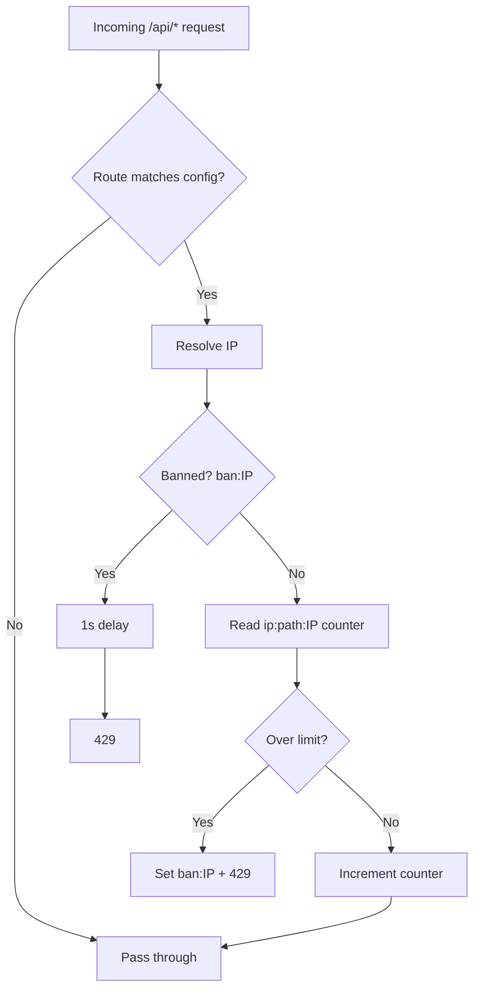

# nuxt-api-shield — Review Findings

Review date: 2026-06-21  
Version reviewed: v1.0.0  
Test status at review: 29/29 tests passing

This document captures performance, security, bug, and feature suggestions from a codebase review. Use it as a backlog for future work.

---

## Security

### 1. Bans are IP-global, not per-route

Ban keys use only the IP (`ban:IP`), while rate-limit counters are per path (`ip:path:IP`). Exceeding the limit on one route bans the IP on all routes.

This may be intentional for brute-force protection but can lock out legitimate users on unrelated endpoints.

**Action:** Consider per-route ban keys (`ban:/api/login:IP`) as a configurable option (`banScope: 'ip' | 'ip+route'`).

---

## New features (high value)

| Feature | Why |
|---------|-----|
| **IP allowlist / CIDR blocklist** | Exempt health checks, internal services, or block known bad ranges |
| **Standard rate-limit headers** | `X-RateLimit-Limit`, `Remaining`, `Reset` on all responses (not only `Retry-After` on ban) |
| **Per-route ban scope** | `banScope: 'ip' \| 'ip+route'` |
| **User/API-key based limiting** | IP limits are weak behind NAT and useless for authenticated APIs |
| **HTTP method limits** | Stricter limits on `POST /api/login` vs `GET /api/public` |
| **Hooks / events** | `onRateLimitExceeded`, `onBan` for Slack alerts, metrics, custom responses |
| **Sliding window algorithm** | Current fixed window allows burst at window boundaries |
| **Configurable storage key prefix** | Avoid collisions if sharing a Redis instance |
| **DevTools panel** | Show active bans, top offenders, storage stats in `@nuxt/devtools` |

---

## Smaller improvements

1. **Export `ModuleOptions` from package exports** — README imports it; verify the public API surface matches `./types` export.
2. **429 response body** — Return JSON `{ error, retryAfter }` instead of plain text for easier client handling.
3. **Ban count / progressive bans** — Escalate ban duration for repeat offenders.
4. **Nitro route rules integration** — Optional tie-in with Nitro's built-in rate limiting for edge deployments.

---

## Architecture summary

---

## Key files referenced

| Area | Path |
|------|------|
| Middleware | `src/runtime/server/middleware/shield.ts` |
| Rate limiting | `src/runtime/server/utils/rateLimit.ts` |
| Ban check | `src/runtime/server/utils/ban.ts` |
| Logging | `src/runtime/server/utils/shieldLog.ts` |
| Route matching | `src/runtime/server/utils/routes.ts` |
| Pattern matching | `src/runtime/server/utils/patternMatcher.ts` |
| Module setup | `src/module.ts` |
| Types | `src/type.d.ts` |
| Cleanup tasks | `src/runtime/server/tasks/shield/` |
