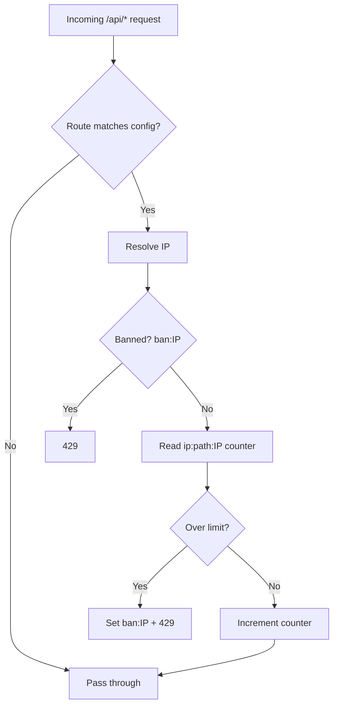

# nuxt-api-shield — Review Findings

Review date: 2026-06-21  
Version reviewed: v0.10.2  
Test status at review: 27/27 tests passing

This document captures performance, security, bug, and feature suggestions from a codebase review. Use it as a backlog for future work.

---

## Bug fixes (confirmed)

### 1. `delayOnBan` is documented but not implemented

The option appears in config, types, and README, but no runtime code applies a delay when a user is banned.

- Defined in `src/type.d.ts` and `src/module.ts` defaults
- Documented in README as delaying responses when banned
- **Not implemented** in `src/runtime/server/utils/ban.ts` or `rateLimit.ts`

**Action:** Either implement in `checkBan()` (e.g. progressive delay based on ban count) or remove from docs/defaults to avoid misleading users.

### 2. README vs module defaults mismatch for logging ✅

| Setting | `module.ts` default | README default |
|---------|---------------------|----------------|
| `log.path` | `''` (disabled) | `""` (fixed) |
| `log.attempts` | `0` (disabled) | `0` (fixed) |

Users reading the README may expect logging on by default when it is actually off.

**Action:** Align README with actual module defaults, or change defaults to match README.  
**Fixed in `8f6d668`:** Both inline config example and default values block updated in README.

### 3. README says per-route `ban` is ignored — code merges it ✅

README stated ban always uses the global value, but `getRouteLimit()` in `src/runtime/server/utils/routes.ts` merges route config over global via `Object.assign({}, config.limit, matchingRoute)`.

The test fixture `test/fixtures/withPerRouteLimit/nuxt.config.ts` even sets `ban: 50` per route.

**Action:** Update docs to reflect per-route `ban` support, or explicitly strip `ban` from route overrides if global-only ban is intended.  
**Fixed:** Removed misleading `// ⚠️ "ban" always uses the global value` comment from README per-route example.

### 4. Playground schedules a non-existent task ✅

`playground/nuxt.config.ts` schedules `shield:clean`, but the module registers:

- `shield:cleanBans`
- `shield:cleanIpData`

Cleanup never runs in the playground.

**Action:** Fix playground `scheduledTasks` to use the correct task names.  
**Fixed:** Changed `'shield:clean'` to `['shield:cleanBans', 'shield:cleanIpData']` in playground config.

### 5. Empty client plugin is registered ✅

`src/runtime/plugin.ts` registers an empty Nuxt plugin with no behavior.

**Action:** Remove unless client-side features are planned.  
**Fixed:** Removed `addPlugin` call from module.ts and deleted the empty `src/runtime/plugin.ts` file.

### 6. Duplicate route matching on every request

In `src/runtime/server/middleware/shield.ts`, `findBestMatchingRoute()` runs once, then `getRouteLimit()` calls it again internally.

**Action:** Cache the first match result and pass it to `getRouteLimit()` to avoid duplicate work.

---

## Security

### 1. Default `trustXForwardedFor: true` is risky

Default in `src/module.ts` is `true`. Spoofed `X-Forwarded-For` headers can bypass limits when the app is not behind a trusted proxy.

**Action:** Consider defaulting to `false` and documenting when to enable (similar to Express `trust proxy`).

### 2. Bans are IP-global, not per-route

Ban keys use only the IP (`ban:IP`), while rate-limit counters are per path (`ip:path:IP`). Exceeding the limit on one route bans the IP on all routes.

This may be intentional for brute-force protection but can lock out legitimate users on unrelated endpoints.

**Action:** Consider per-route ban keys (`ban:/api/login:IP`) as a configurable option (`banScope: 'ip' | 'ip+route'`).

### 3. Race condition under concurrency

Rate limiting uses read → increment → write without atomicity in `src/runtime/server/utils/rateLimit.ts`. Concurrent requests can both read the same count and slip through.

**Action:** With Redis, use `INCR` or Lua scripts. Document this limitation for `memory`/`fs` drivers.

### 4. IPv6 + filesystem storage keys

Keys like `ip:/api/foo:2001:db8::1` contain many colons. The `fs` driver may mishandle these on some filesystems.

**Action:** Sanitize IPs in keys (e.g. replace `:` with `_` or use a hash).

### 5. No validation that `shield` storage exists

If users forget `nitro.storage.shield`, requests fail at runtime with an unclear error.

**Action:** Add a startup check in the module `setup()` hook with a clear error message.

### 6. Prefix matching can over-match

Legacy prefix matching in `findBestMatchingRoute()` means a route like `/api/v3` also matches `/api/v3-secret`.

**Action:** Prefer explicit patterns or document this behavior clearly.

---

## Performance

### 1. Multiple storage round-trips per request

Each protected request typically performs:

- `getItem(banKey)`
- optionally `removeItem(banKey)`
- `getItem(ipKey)` + `setItem(ipKey)`

That is 2–4 I/O operations per request.

**Action:** With Redis, consider pipelining or a single JSON blob per IP. Document that `fs` does not scale well under load.

### 2. Recommend Redis for production

For multi-instance deployments, `memory` and `fs` are per-process and ineffective.

**Action:** Document Redis (or another shared store) as required for production clusters.

### 3. Cleanup tasks scan all keys

`cleanBans` and `cleanIpData` call `getKeys()` and iterate every entry. At large scale this can block the event loop.

**Action:** Consider TTL-native storage (Redis `EXPIRE`), batched SCAN, or rely more on lazy expiry on read (already done for bans in middleware).

### 4. File logging on hot path

`shieldLog()` uses `appendFile` on the request path when `count >= attempts`. Under attack, this adds disk I/O.

**Action:** Consider async buffering or delegating to a logging service.

### 5. Slow integration tests (~41s)

Ban tests use real `setTimeout` waits (10+ seconds).

**Action:** Use fake timers or inject shorter ban durations in test fixtures to speed CI.

---

## New features (high value)

| Feature | Why |
|---------|-----|
| **IP allowlist / CIDR blocklist** | Exempt health checks, internal services, or block known bad ranges |
| **`skipRoutes` / `excludeRoutes`** | Exempt `/api/health`, `/api/_nuxt/*`, webhooks |
| **Standard rate-limit headers** | `X-RateLimit-Limit`, `Remaining`, `Reset` on all responses (not only `Retry-After` on ban) |
| **Per-route ban scope** | `banScope: 'ip' \| 'ip+route'` |
| **User/API-key based limiting** | IP limits are weak behind NAT and useless for authenticated APIs |
| **HTTP method limits** | Stricter limits on `POST /api/login` vs `GET /api/public` |
| **Hooks / events** | `onRateLimitExceeded`, `onBan` for Slack alerts, metrics, custom responses |
| **Sliding window algorithm** | Current fixed window allows burst at window boundaries |
| **Configurable storage key prefix** | Avoid collisions if sharing a Redis instance |
| **DevTools panel** | Show active bans, top offenders, storage stats in `@nuxt/devtools` |
| **Fail2ban export format** | Structured log format for automatic IP blocking at the firewall |

---

## Smaller improvements

1. **Export `ModuleOptions` from package exports** — README imports it; verify the public API surface matches `./types` export.
2. **429 response body** — Return JSON `{ error, retryAfter }` instead of plain text for easier client handling.
3. **Ban count / progressive bans** — Escalate ban duration for repeat offenders.
4. **Nitro route rules integration** — Optional tie-in with Nitro's built-in rate limiting for edge deployments.
5. **CHANGELOG duplicate v0.10.2 section** — Two entries for the same version; clean up for clarity.

---

## Architecture summary

The design is solid for single-instance apps with moderate traffic. Main gaps: missing `delayOnBan`, non-atomic counters, global IP bans, and docs/defaults drift.

---

## Suggested priority order

1. **Fix `delayOnBan`** (implement or remove) — user-facing bug
2. **Align README defaults with code** — reduces confusion
3. **Default `trustXForwardedFor` to `false`** — security hardening
4. **Add startup storage validation** — better DX
5. **Cache route match + document Redis requirement** — performance
6. **Add `skipRoutes` + rate-limit headers** — practical features

---

## Key files referenced

| Area | Path |
|------|------|
| Middleware | `src/runtime/server/middleware/shield.ts` |
| Rate limiting | `src/runtime/server/utils/rateLimit.ts` |
| Ban check | `src/runtime/server/utils/ban.ts` |
| Route matching | `src/runtime/server/utils/routes.ts` |
| Pattern matching | `src/runtime/server/utils/patternMatcher.ts` |
| Module setup | `src/module.ts` |
| Types | `src/type.d.ts` |
| Cleanup tasks | `src/runtime/server/tasks/shield/` |
