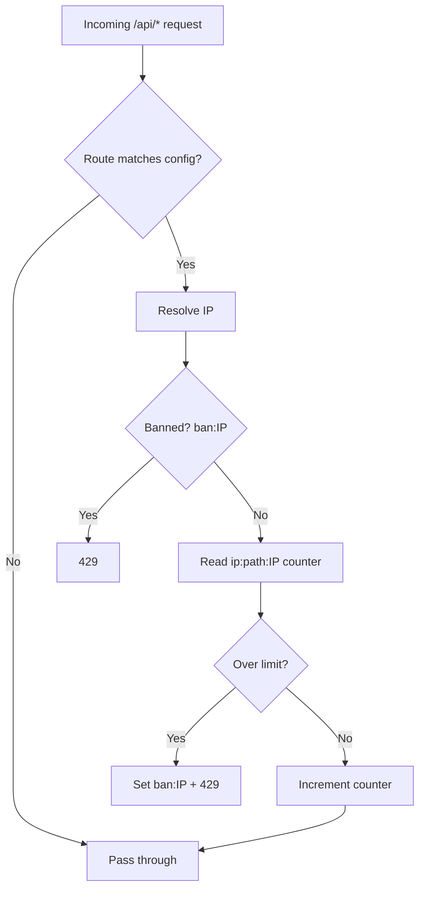

# nuxt-api-shield — Review Findings

Review date: 2026-06-21  
Version reviewed: v0.10.2  
Test status at review: 27/27 tests passing

This document captures performance, security, bug, and feature suggestions from a codebase review. Use it as a backlog for future work.

---

## Security

### 1. Default `trustXForwardedFor: true` is risky

Default in `src/module.ts` is `true`. Spoofed `X-Forwarded-For` headers can bypass limits when the app is not behind a trusted proxy.

**Action:** Consider defaulting to `false` and documenting when to enable (similar to Express `trust proxy`).  
**Fixed:** Default changed to `false`. Fallback in middleware aligned to `?? false`. README Security Warning updated. Users behind a trusted proxy should explicitly set `security: { trustXForwardedFor: true }`.

### 2. Bans are IP-global, not per-route

Ban keys use only the IP (`ban:IP`), while rate-limit counters are per path (`ip:path:IP`). Exceeding the limit on one route bans the IP on all routes.

This may be intentional for brute-force protection but can lock out legitimate users on unrelated endpoints.

**Action:** Consider per-route ban keys (`ban:/api/login:IP`) as a configurable option (`banScope: 'ip' | 'ip+route'`).

### 3. IPv6 + filesystem storage keys

Keys like `ip:/api/foo:2001:db8::1` contain many colons. The `fs` driver may mishandle these on some filesystems.

**Action:** Sanitize IPs in keys (e.g. replace `:` with `_` or use a hash).  
**Fixed:** `createKey()` now replaces `:` with `_` in the IP address before building the key. IPv6 `2001:db8::1` becomes `2001_db8__1` in storage keys. IPv4 addresses (dots, no colons) are unchanged.

### 4. No validation that `shield` storage exists

If users forget `nitro.storage.shield`, requests fail at runtime with an unclear error.

**Action:** Add a startup check in the module `setup()` hook with a clear error message.

### 5. Prefix matching can over-match

Legacy prefix matching in `findBestMatchingRoute()` means a route like `/api/v3` also matches `/api/v3-secret`.

**Action:** Prefer explicit patterns or document this behavior clearly.

---

## Performance

### 1. File logging on hot path

`shieldLog()` uses `appendFile` on the request path when `count >= attempts`. Under attack, this adds disk I/O.

**Action:** Consider async buffering or delegating to a logging service.  
**Fixed:** Removed `await` from the `shieldLog` call (fire-and-forget) and added an in-memory buffer that flushes to disk every 5 seconds via `setInterval`. Disk I/O drops from O(requests) to O(1 per 5s).

---

## New features (high value)

| Feature | Why |
|---------|-----|
| **IP allowlist / CIDR blocklist** | Exempt health checks, internal services, or block known bad ranges |
| **`skipRoutes` / `excludeRoutes`** | Exempt `/api/health`, `/api/_nuxt/*`, webhooks |
| **Standard rate-limit headers** | `X-RateLimit-Limit`, `Remaining`, `Reset` on all responses (not only `Retry-After` on ban) |
| **Per-route ban scope** | `banScope: 'ip' \| 'ip+route'` |
| **User/API-key based limiting** | IP limits are weak behind NAT and useless for authenticated APIs |
| **HTTP method limits** | Stricter limits on `POST /api/login` vs `GET /api/public` |
| **Hooks / events** | `onRateLimitExceeded`, `onBan` for Slack alerts, metrics, custom responses |
| **Sliding window algorithm** | Current fixed window allows burst at window boundaries |
| **Configurable storage key prefix** | Avoid collisions if sharing a Redis instance |
| **DevTools panel** | Show active bans, top offenders, storage stats in `@nuxt/devtools` |
| **Fail2ban export format** | Structured log format for automatic IP blocking at the firewall |

---

## Smaller improvements

1. **Export `ModuleOptions` from package exports** — README imports it; verify the public API surface matches `./types` export.
2. **429 response body** — Return JSON `{ error, retryAfter }` instead of plain text for easier client handling.
3. **Ban count / progressive bans** — Escalate ban duration for repeat offenders.
4. **Nitro route rules integration** — Optional tie-in with Nitro's built-in rate limiting for edge deployments.
5. **CHANGELOG duplicate v0.10.2 section** — Two entries for the same version; clean up for clarity. **Fixed in v1.0.0.**

---

## Architecture summary

---

## Key files referenced

| Area | Path |
|------|------|
| Middleware | `src/runtime/server/middleware/shield.ts` |
| Rate limiting | `src/runtime/server/utils/rateLimit.ts` |
| Ban check | `src/runtime/server/utils/ban.ts` |
| Route matching | `src/runtime/server/utils/routes.ts` |
| Pattern matching | `src/runtime/server/utils/patternMatcher.ts` |
| Module setup | `src/module.ts` |
| Types | `src/type.d.ts` |
| Cleanup tasks | `src/runtime/server/tasks/shield/` |
